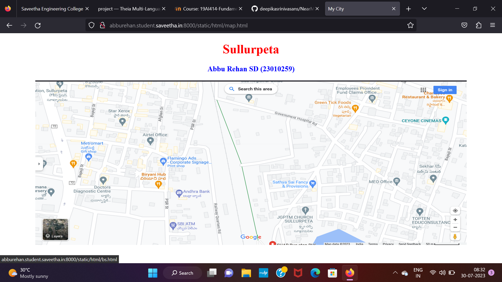
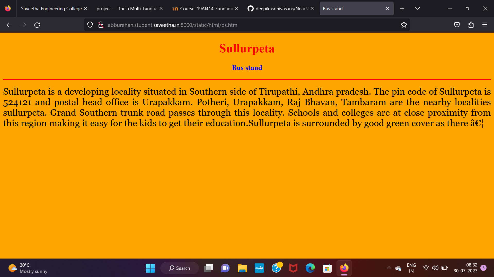
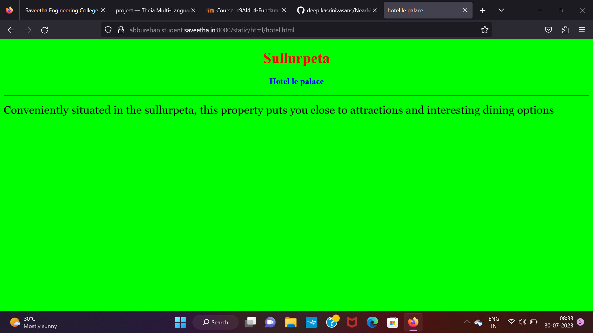
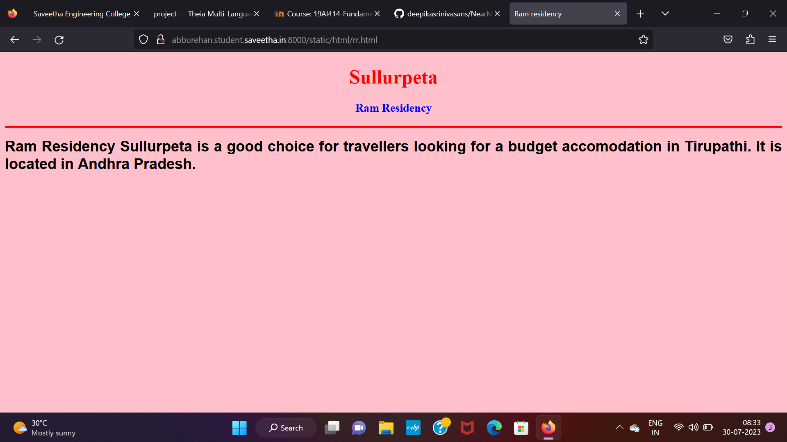
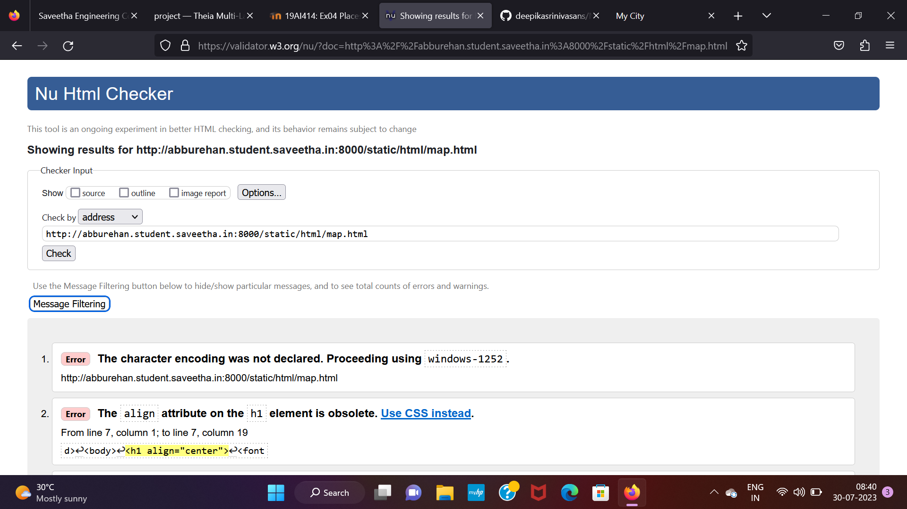

# Places Around Me
## AIM:
To develop a website to display details about the places around my house.

## Design Steps:

### Step 1:
Clone the github repository into Theia IDE.

### Step 2:
Create a new Django project.

### Step 3:
Write the needed HTML code.

### Step 4:
Run the Django server and excute the HTML files.

## Code:

map.html

```
<!DOCTYPE html>
<html lang="en">
<head>
<title>My City</title>
</head>
<body>
<h1 align="center">
<font color="red"><b>Sullurpeta</b></font>
</h1>
<h3 align="center">
<font color="blue"><b> Abbu Rehan SD (23010259)</b></font>
</h3>
<center>

<map name="MyCity">
<area shape="circle" coords="190,50,20" href="/static/html/kfc.html" title="kfc">
<area shape="rectangle" coords="230,30,260,60" href="/static/html/sth.html" title="sanns tropicana hotel">
<area shape="circle" coords="400,350,50" href="/static/html/rr.html" title="ram residency">
<area shape="circle" coords="400,200,75" href="/static/html/hotel.html" title="hotel le palace">
<area shape="rectangle" coords="490,150,870,320" href="/static/html/bs.html" title="bus stand">
</map>
</center>
</body>
</html>

bs.html

<!DOCTYPE html>
<html lang="en">
<head>
<title>Bus stand</title>
</head>
<body bgcolor="orange">
<h1 align="center">
<font color="red"><b>Sullurpeta</b></font>
</h1>
<h3 align="center">
<font color="blue"><b>Bus stand</b></font>
</h3>
<hr size="3" color="red">
<p align="justify">
<font face="Georgia" size="5">
Sullurpeta is a developing locality situated in Southern side of Tirupathi, Andhra pradesh. The pin code of Sullurpeta is 524121 and postal head office is Urapakkam. Potheri, Urapakkam, Raj Bhavan, Tambaram are the nearby localities sullurpeta. Grand Southern trunk road passes through this locality. Schools and colleges are at close proximity from this region making it easy for the kids to get their education.Sullurpeta is surrounded by good green cover as there …</font>
</p>
</body>
</html>

hotel.html

<!DOCTYPE html>
<html lang="en">
<head>
<title>hotel le palace</title>
</head>
<body bgcolor="lime">
<h1 align="center">
<font color="red"><b>Sullurpeta</b></font>
</h1>
<h3 align="center">
<font color="blue"><b>Hotel le palace</b></font>
</h3>
<hr size="3" color="red">
<p align="justify">
<font face="Georgia" size="5">
Conveniently situated in the sullurpeta, this property puts you close to attractions and interesting dining options</font>
</p>
</body>
</html>

kfc.html

<!DOCTYPE html>
<html lang="en">
<head>
<title>kfc</title>
</head>
<body bgcolor="cyan">
<h1 align="center">
<font color="red"><b>Sullurpeta</b></font>
</h1>
<h3 align="center">
<font color="blue"><b>kFC</b></font>
</h3>
<hr size="3" color="red">
<p align="justify">
<font face="Courier New" size="5">
<b>
KFC (Kentucky Fried Chicken) is an American fast food restaurant chain headquartered in Louisville, Kentucky, that specializes in fried chicken. It is the world's second-largest restaurant chain (as measured by sales) after McDonald's, with 22,621 locations globally in 150 countries as of December 2019.[4] The chain is a subsidiary of Yum! Brands, a restaurant company that also owns the Pizza Hut and Taco Bell chains.[5]
KFC was founded by Colonel Harland Sanders (1890–1980), an entrepreneur who began selling fried chicken from his roadside restaurant in Corbin, Kentucky, during the Great Depression. Sanders identified the potential of the restaurant franchising concept and the first "Kentucky Fried Chicken" franchise opened in Utah in 1952. KFC popularized chicken in the fast-food industry, diversifying the market by challenging the established dominance of the hamburger. By branding himself as "Colonel Sanders", Harland became a prominent figure of American cultural history and his image remains widely used in KFC advertising to this day. However, the company's rapid expansion overwhelmed the aging Sanders and he sold it to a group of investors led by John Y. Brown Jr. and…</b>
</font>
</p>
</body>
</html>

sth.html

<!DOCTYPE html>
<html lang="en">
<head>
<title>sanns tropicana hotel</title>
</head>
<body bgcolor="yellow">
<h1 align="center">
<font color="red"><b>Sullurpeta</b></font>
</h1>
<h3 align="center">
<font color="blue"><b>Sanns tropicana hotel
</b></font>
</h3>
<hr size="3" color="red">
<p align="justify">
<font face="Tahoma" size="5">
Overall hotel is very good, in tems of cleanliness, room service, hospitality, food quality, staff behaviour. Only the negative points is its cost. </font>
</p>
</body>
</html>

rr.html

<!DOCTYPE html>
<html lang="en">
<head>
<title>Ram residency</title>
</head>
<body bgcolor="pink">
<h1 align="center">
<font color="red"><b>Sullurpeta</b></font>
</h1>
<h3 align="center">
<font color="blue"><b>Ram Residency</b></font>
</h3>
<hr size="3" color="red">
<p align="justify">
<font face="Arial" size="5">
<b>
Ram Residency Sullurpeta is a good choice for travellers looking for a budget accomodation in Tirupathi. It is located in Andhra Pradesh.</b>
</font>
</p>
</body>
</html>
```

## Output:








## HTML Validator 



## Result:
The program for implementing image map is excuted successfully.